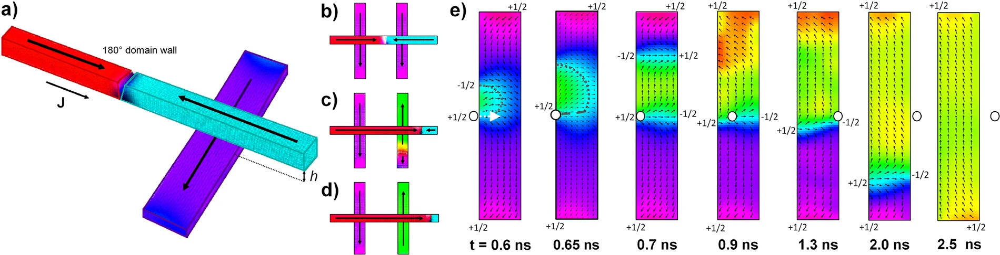
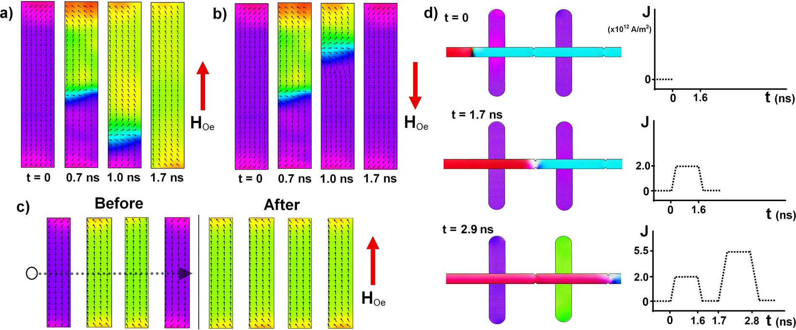
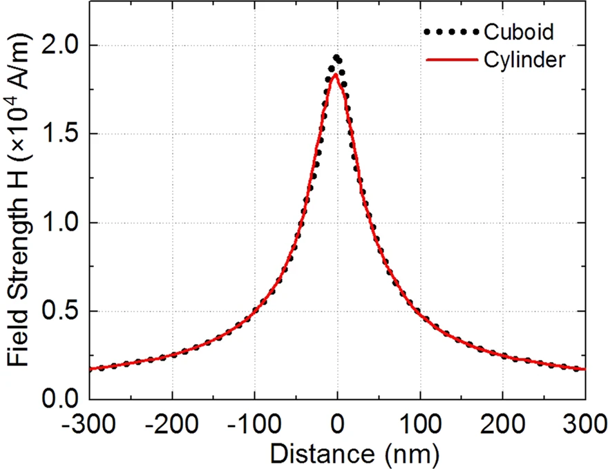

# Current-Controlled Nanomagnetic Writing for Reconfigurable Magnonic Crystals (CCNW4RMC)
----

<b>All source code and images are associated with the paper:  
<i>"Current-controlled nanomagnetic writing for reconfigurable magnonic crystals" (2020)</i>, 
Nature Communications Physics  
(Accepted for Publication)</b> 
<a href="https://www.nature.com/articles/s42005-020-00487-y">Paper HTML</a>

----

## Introduction

Strongly-interacting nanomagnetic arrays are crucial across an ever-growing suite of technologies. Spanning neuromorphic computing, control over superconducting vortices and reconfigurable magnonics, the utility and appeal of these arrays lies in their vast range of distinct, stable magnetization states. Different states exhibit different functional behaviours, making precise, reconfigurable state control an essential cornerstone of such systems. However, few existing methodologies may reverse an arbitrary array element, and even fewer may do so under electrical control, vital for device integration. We demonstrate selective, reconfigurable magnetic reversal of ferromagnetic nanoislands via current-driven motion of a transverse domain wall in an adjacent nanowire. The reversal technique operates under all-electrical control with no reliance on external magnetic fields, rendering it highly suitable for device integration across a host of magnonic, spintronic and neuromorphic logic architectures.

Below is the schematic of the magnetic reversal method. 

Figure 1: (a) Representation of the ferromagnetic domain wall-carrying ‘control’ nanowire and ‘bit’ nanoisland, separated by a non-magnetic gap of height h. (b)–(d) Time-evolution series of the magnetic reversal process in two-nanoisland system. Both nanoislands are initially magnetized with 𝑀 = −𝑦̂  (b) before the current-driven ‘control’ domain wall (c-DW) traverses the right-hand nanoisland, inducing magnetization reversal (c), leaving it magnetized 𝑀 = +𝑦̂, whereas the left-hand nanoisland remains unswitched (d). It is noteworthy that the internal domain wall structure in (c) and (d) is slightly distorted by the drive-current; (b) shows the static, relaxed domain wall state. (e) Detailed time-evolution series of the reversal process in a single 400 × 75 × 5 nm3 nanoisland. The dynamic c-DW is represented by the white circle traversing the nanoisland midpoint, moving with 𝑣c−DW = +𝑥̂. t = 0 s is defined when the c-DW begins moving from its origin, 112 nm to the nanoisland’s left. The partially formed contorted nanoisland domain wall is highlighted in t = 0.6 ns by the dashed grey line, with the partially formed straight island domain wall highlighted by longer grey dashes in t = 0.65 ns. Topological defects are labelled with their winding numbers.

- codes 
- mumax website

## Simulations
Below are the simulations that were generated using the code herein.

(i) 

https://user-images.githubusercontent.com/56391325/145732471-5ed2b45b-24d0-443d-9188-ded5e096215c.mp4

## Figures
Below are the figures as presented in the paper:

Figure 2: Close-proximity and fully selective reversal modes. (a)–(c) Close-proximity reversal mode. (d) Fully selective reversal. (a) With Oersted-field HOe antiparallel to the initial nanoisland magnetization HOe aids reversal, driving the low- and high-energy nanoisland domain walls (i-DWs) to opposite nanoisland ends and achieving successful switching. (b) With HOe aligned to the initial nanoisland magnetization, the reversal process is hindered, HOe drives the low- and high-energy i-DWs into the same nanoisland end, resulting in failed switching. (c) Four-island array initialized (‘before’ panel) with second and third islands in 𝑀 = +𝑦̂  state, and first and fourth in 𝑀 = −𝑦̂  state. Control domain wall (c-DW) is then driven across the array such that 𝐇Oe = +𝑦̂, driving successful reversal of 𝑀 = −𝑦̂  islands (as described in (a)) and failed reversal of 𝑀 = +𝑦̂  islands (as in (b)). (d) c-DW begins to the left of two nanoislands (t = 0). It is driven over the first nanoisland by a J = 2.0 × 1012 A/m2 ‘skip’ current pulse, leaving the nanoisland unswitched as HOe + HDW  < HN, the nucleation field. The c-DW is then driven over the second nanoisland with a J = 5.5 × 1012 A/m2 ‘write’ pulse, switching the nanoisland magnetization as HOe + HDW ≥ HN.

Figure 3: Field profiles of current-carrying cylindrical and cuboid nanowires. Field profile experienced by a nanoisland that is positioned h = 10 nm below an infinitely long cylinder and cuboid. There is a small discrepancy of 0.15 × 104 Am-1 around x = 0, which can be minimized by adjusting the value of the current density.

## Citation
Gartside, J.C., Jung, S.G., Yoo, S.Y. et al. Current-controlled nanomagnetic writing for reconfigurable magnonic crystals. Commun Phys **3**, 219 (2020). https://doi.org/10.1038/s42005-020-00487-y

## 🔗 Links

## License

